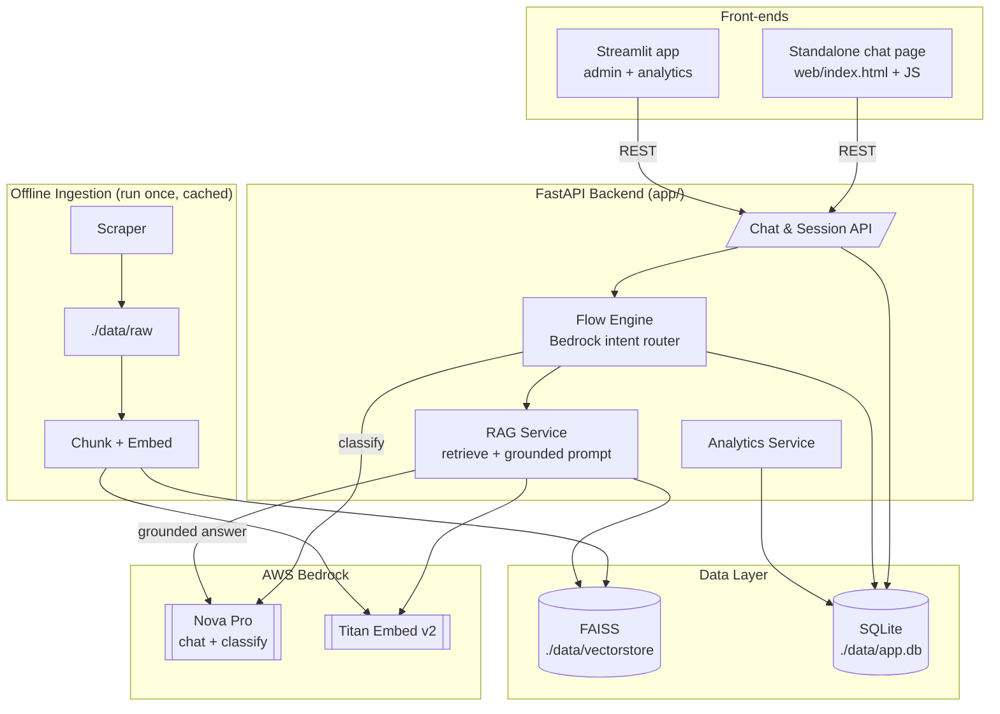

# Final Plan — ness.com RAG Flow-Aware Chatbot (Hackathon MVP)

This is the single source of truth. It supersedes `plan.md`, `plan2.md`, and the
architecture in `README.md` where they conflict. Those files stay as history.

## 1. Locked Decisions

| Area | Decision | Source |
|---|---|---|
| Product focus | **Information-driven chatbot for ness.com only.** No transactional/service actions. | Q&A |
| Backend | **FastAPI** backend exposing a REST API. | README.md |
| Front-ends | **Streamlit** admin/analytics app **+ standalone HTML/JS chat page** calling the FastAPI REST API. | Q&A |
| Chat model | **Amazon Nova Pro** (`amazon.nova-pro-v1:0`) via Bedrock **Converse API**. | plans |
| Embeddings | **Amazon Titan Embed Text v2** (`amazon.titan-embed-text-v2:0`), 1024-dim normalized. | plans |
| Vector store | **FAISS** `IndexFlatIP`, persisted locally. | plans |
| Persistence | **SQLite** (sessions, messages, flow_events). | all |
| Scraper | `requests` + `BeautifulSoup`, same-domain BFS, static HTML only. No Playwright. | plans |
| Flow engine | Bedrock intent router → info flows (satisfies "≥2 flows"). | README.md |
| AWS SDK | `boto3` directly (Converse + `invoke_model`). Only `langchain-core` if needed. | plan.md |

### Explicitly OUT of scope (documented as future work)
- Arbitrary real-site automation, generic HTTP agent, form discovery.
- Mock service API, order track/cancel flows, write actions, human approval cards.
- SSRF / domain-allowlist guards (not needed without arbitrary actions).
- Embeddable third-party `<script>` widget (we build our own standalone page instead).
- LangGraph agent loop / interrupts (deterministic flow router is enough for info flows).
- SMTP / SMS / calendar integrations.

---

## 2. Architecture



**Responsibility split**
- **LLM (Nova Pro)** — classify intent, extract slots, write grounded answers.
- **RAG** — retrieve top-k chunks from FAISS, build grounded/cited prompt.
- **Flow Engine** — deterministic routing + `flow_events` logging.
- **SQLite** — persist sessions, messages, flow events (chat review + analytics).
- **Front-ends** — standalone page for the chat demo; Streamlit for admin/analytics.

---

## 3. Flows (satisfies "minimum 2 flows")

| Flow | Trigger example | Handler behavior |
|---|---|---|
| `greeting` | "hi", "hello" | Static welcome, no LLM/RAG |
| `service_list` | "what services do you provide" | RAG over service pages → summarized list |
| `service_detail` | "explain more on Salesforce" | Extract service slot → RAG scoped to that service |
| `general_qa` | "where are your offices" | Open RAG across all indexed pages |
| `fallback` | ambiguous / low confidence | Ask a clarifying question |

Each turn: **classify → route → (RAG) → reply with sources → log `flow_event`**.

---

## 4. Project Structure

```text
hackathon/
├── requirements.txt
├── .env                     # AWS creds (gitignored)
├── .gitignore
├── README.md                # existing architecture notes (history)
├── FINAL_PLAN.md            # this file
│
├── data/
│   ├── raw/                 # cached scraped pages
│   ├── vectorstore/         # FAISS index + metadata
│   └── app.db               # SQLite
│
├── ingest/
│   ├── scraper.py           # fetch + clean + BFS crawl + chunk
│   └── ingest.py            # embed chunks + build/persist FAISS
│
├── app/                     # FastAPI backend
│   ├── __init__.py
│   ├── config.py            # load .env (custom var names) + model IDs
│   ├── bedrock.py           # boto3 Bedrock: chat() + embed()
│   ├── vectorstore.py       # FAISS wrapper (search/save/load)
│   ├── rag.py               # retrieve + grounded prompt
│   ├── flows.py             # intent router + per-flow handlers
│   ├── analytics.py         # flow report queries
│   ├── db.py                # SQLite schema + helpers
│   └── main.py              # FastAPI app + routes + CORS
│
├── ui/
│   └── streamlit_app.py     # admin: ingest, chat test, conversation review, analytics
│
└── web/
    └── index.html           # standalone chat page (HTML + JS → FastAPI)
```

---

## 5. Data Model (SQLite)

```text
sessions(id, source, user_agent, started_at, ended_at, status, meta)
messages(id, session_id, role, content, flow, sources_json, created_at)
flow_events(id, session_id, flow, intent_confidence, matched, answered, created_at)
```

---

## 6. API Contract (FastAPI)

```text
POST /sessions
  res:  { session_id }

POST /chat
  req:  { session_id, message }
  res:  { reply, flow, confidence, sources: [{ title, url }] }

GET  /sessions/{id}
  res:  { session, messages: [...], flow_events: [...] }

GET  /analytics/report
  res:  { totals: {...}, per_flow: [...], fallback_rate, top_sources }

POST /ingest            # admin-triggered crawl + embed
  req:  { url, max_pages, max_depth }
  res:  { pages, chunks, sources }
```

CORS enabled so `web/index.html` can call the API from a browser.

---

## 7. Implementation Order

**Milestone 1 — Foundation**
- [ ] Scaffold folders/files, `requirements.txt`, `.gitignore`, `data/`.
- [ ] `app/config.py`: read `ACCESS_KEY_ID` / `SECRET_ACCESS_KEY` / `AWS_REGION` explicitly (custom names, no `AWS_` prefix — boto3 won't auto-detect), pass to `boto3.client`.
- [ ] `app/bedrock.py`: `chat(messages, system_prompt)` via Converse; `embed(text)` via Titan.
- [ ] Standalone smoke test: AWS auth ✓, Nova Pro ✓, Titan Embed v2 ✓ (surfaces `AccessDenied` early).

**Milestone 2 — Ingestion + RAG**
- [ ] `ingest/scraper.py`: `fetch_page`, `extract_text`, `crawl` (BFS same-domain, `max_pages`/`max_depth`, timeouts, robots.txt courtesy), `chunk_text` (~900/150 overlap, metadata `{source_url, title, chunk_index}`).
- [ ] `app/vectorstore.py`: FAISS `IndexFlatIP`, `add_texts`, `similarity_search(k=5)`, `save`/`load`, auto-load on startup.
- [ ] `ingest/ingest.py`: embed chunks → FAISS → persist to `./data/vectorstore/`.
- [ ] `app/rag.py`: retrieve → grounded, cited prompt → Nova Pro answer with source URLs.

**Milestone 3 — Flow engine + Chat API**
- [ ] `app/flows.py`: Bedrock classifier → `{flow, confidence, slots}`; per-flow handlers; low-confidence → fallback.
- [ ] `app/db.py`: SQLite schema + insert/query helpers.
- [ ] `app/main.py`: `/sessions`, `/chat`, `/sessions/{id}`, `/ingest`, `/analytics/report`; log messages + flow_events; CORS.

**Milestone 4 — Front-ends**
- [ ] `web/index.html`: minimal chat UI, holds `session_id`, posts to `/chat`, shows reply + sources.
- [ ] `ui/streamlit_app.py`: ingest form, chat tester, conversation review, analytics page.

**Milestone 5 — Analytics + polish**
- [ ] `app/analytics.py`: totals, per-flow counts, fallback rate, top source pages.
- [ ] (Stretch) AI insight over flow stats via Nova Pro.
- [ ] README run instructions; confirm `.env` excluded from git; end-to-end pass.

---

## 8. Security (right-sized for this scope)

- `.env` in `.gitignore`; **never** expose AWS creds to the browser (server-side only).
- Treat all scraped content + retrieved chunks as **untrusted data, not instructions** (system prompt).
- Request timeouts + response size caps on all outbound scrape requests.
- CORS restricted to the local demo origins.
- No SSRF/domain-allowlist machinery needed (no arbitrary outbound actions in scope).

> ⚠️ `plan.md` notes the existing `.env` contains live AWS keys in plaintext with no
> `.gitignore`. Add `.gitignore` first, and rotate those keys if they were ever shared.

---

## 9. Definition of Done

End-to-end demo works:

```text
Ingest ness.com  →  FAISS built (pages, chunks cached)
        ↓
Standalone chat page: "hi"              → greeting flow, welcome
"what services do you provide"          → service_list, grounded + sources
"explain more on Salesforce"            → service_detail, scoped RAG + sources
ambiguous question                      → fallback, clarifying question
        ↓
Every turn persisted (sessions, messages, flow_events)
        ↓
Streamlit: review a full conversation transcript
        ↓
Streamlit analytics: flow distribution, fallback rate, top sources
```

---

## 10. Verification Checklist

1. Bedrock smoke test passes (auth + Nova Pro + Titan Embed v2).
2. Ingest ness.com → sources + chunk count reported; FAISS persisted.
3. Restart backend without re-ingesting → knowledge base still loads from disk.
4. `service_list` question → grounded answer with correct source URLs.
5. `service_detail` on a named service → RAG scoped correctly.
6. Ambiguous input → `fallback` clarifying question (no hallucinated answer).
7. Standalone page maintains `session_id` across turns.
8. Conversation + flow_events persisted and viewable in Streamlit.
9. Analytics report reflects the flows exercised in the demo.
10. Bad/unreachable ingest URL → clean error, no crash.
```
