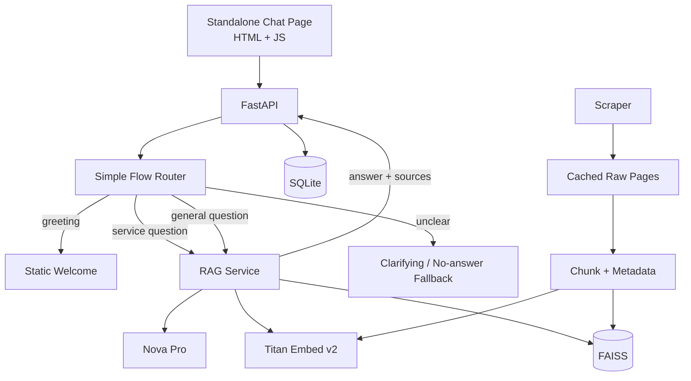

# Final Plan — ness.com RAG Flow-Aware Chatbot (Hackathon MVP)

This is the single source of truth for the hackathon MVP. It supersedes the older planning/architecture notes where they conflict.

The goal is a small, reliable, information-driven chatbot for **ness.com** that can demonstrate:

1. Website ingestion into a local knowledge base.
2. Grounded answers using RAG.
3. A small set of deterministic conversation flows.
4. Source links with answers.
5. Basic conversation logging and analytics.

The design intentionally avoids features that add demo risk without materially improving the MVP.

---

## 1. Locked Decisions

| Area | Decision |
|---|---|
| Product focus | Information-driven chatbot. No transactional/service actions. |
| Backend | **FastAPI** REST API. |
| Front-end | Standalone **HTML/JS chat page** for the demo. |
| Chat model | **Amazon Nova Pro** (`amazon.nova-pro-v1:0`) via Bedrock Converse API. |
| Embeddings | **Amazon Titan Embed Text v2** (`amazon.titan-embed-text-v2:0`), 1024-dim normalized. |
| Vector store | **FAISS** `IndexFlatIP`, persisted locally. |
| Persistence | **SQLite** for sessions, messages, and flow events. |
| Scraper | `requests` + `BeautifulSoup`, same-domain BFS, static HTML only. No Playwright. |
| Routing | **Simple deterministic routing first**. Use the LLM for answering; do not require an LLM classification call on every turn. |
| AWS SDK | `boto3` directly. |
| Knowledge scope | Only content crawled from `ness.com`. |
| Ingestion | Rebuild the local index cleanly when ingestion is run. No incremental sync for the MVP. |

### Explicitly out of scope

- Arbitrary real-site automation.
- Generic HTTP agents.
- Form discovery/submission.
- Order tracking/cancellation or write actions.
- Mock service APIs.
- Human approval cards.
- Playwright/browser automation.
- LangGraph agent loops or interrupts.
- SMTP, SMS, calendar integrations.
- Third-party embeddable widget.
- Incremental/vector-index synchronization.
- Complex reranking pipelines.
- Advanced authentication/identity management.

---

## 2. MVP Architecture



### Request path

```text
User message
    ↓
Simple router
    ↓
Greeting / service flow / general Q&A / fallback
    ↓
For knowledge questions: embed → retrieve → evidence check
    ↓
Nova Pro generates grounded answer
    ↓
Answer + source URLs
    ↓
Persist message + flow event
```

### Responsibility split

- **Router** — decides which small flow should handle the request.
- **RAG** — retrieves relevant website content and decides whether enough evidence exists.
- **Nova Pro** — writes the final answer using retrieved evidence only.
- **FAISS** — stores/query embeddings locally.
- **SQLite** — stores sessions, messages, and flow events.
- **Standalone web page** — judge-facing chatbot.
- **Streamlit** — admin/analytics only.

---

## 3. Flows

Keep the flow set intentionally small.

| Flow | Example | Behavior |
|---|---|---|
| `greeting` | `hi`, `hello` | Static welcome. No RAG needed. |
| `service_list` | `what services do you provide?` | Retrieve service-related content and summarize it with sources. |
| `service_detail` | `explain more on Salesforce` | Detect/normalize the named service, scope retrieval to that service when possible, then answer with sources. |
| `general_qa` | `where are your offices?` | Search across the whole indexed site and answer from evidence. |
| `fallback` | unclear / unsupported / no evidence | Ask a concise clarifying question or say the information could not be found. |

### Routing rule

Use deterministic checks before involving an LLM classifier.

Example logic:

```text
if greeting → greeting
elif service-list phrase → service_list
elif known service name → service_detail
else → general_qa
```

The router does not need to perfectly understand every sentence. For a hackathon, **predictable routing + good retrieval** is more valuable than a second LLM call on every turn.

---

## 4. Retrieval and Grounding

### Retrieval pipeline

```text
User question
    ↓
Titan embedding
    ↓
FAISS top-k search (k=5)
    ↓
Similarity threshold
    ↓
Optional service metadata filter
    ↓
Evidence chunks
    ↓
Grounded Nova Pro prompt
    ↓
Answer + source URLs
```

### Important rule: no evidence = no answer

Do not force an answer from the top-k results.

If the best retrieved chunks are below the configured similarity threshold, return a safe fallback such as:

> I couldn't find that information on ness.com.

This is required even when the intent/router is confident.

### Grounding rules for the answer prompt

The answer model should be instructed to:

1. Use only the retrieved website content.
2. Do not invent facts not supported by the evidence.
3. Say when the evidence is insufficient.
4. Keep answers concise.
5. Include the most relevant source URLs.

---

## 5. Ingestion

### Fixed source

The MVP crawls a fixed site:

```text
https://ness.com
```

The public API does **not** accept an arbitrary ingestion URL.

### Scraper behavior

`requests` + `BeautifulSoup`:

- Same-domain BFS crawl.
- `max_pages` and `max_depth` limits.
- Request timeout.
- Response size cap.
- Basic `robots.txt` courtesy.
- Static HTML only.
- Skip obvious non-HTML assets.
- Normalize/clean page text.

### Chunking

Start with approximately:

```text
chunk size: ~900 tokens/words equivalent used by implementation
overlap: ~150
```

The exact unit can be tuned after the first real crawl. Do not over-optimize it for the MVP.

### Required chunk metadata

Each chunk should carry at least:

```json
{
  "source_url": "https://ness.com/...",
  "title": "Page title",
  "chunk_index": 3,
  "service": "Salesforce"
}
```

`service` can be null for general pages.

This makes `service_detail` retrieval straightforward without creating a complex content taxonomy.

### Re-ingestion

For the MVP, rebuild the local knowledge base from scratch:

```text
crawl
  ↓
raw pages
  ↓
chunks
  ↓
embeddings
  ↓
new FAISS index
```

Replace the previous local index only after the new build succeeds.

Keep a small manifest:

```json
{
  "base_url": "https://ness.com",
  "pages": 42,
  "chunks": 318,
  "created_at": "..."
}
```

This makes the demo/debugging much easier.

---

## 6. Data Model

SQLite:

```text
sessions(
  id,
  source,
  user_agent,
  started_at,
  ended_at,
  status,
  meta
)

messages(
  id,
  session_id,
  role,
  content,
  flow,
  sources_json,
  created_at
)

flow_events(
  id,
  session_id,
  flow,
  confidence,
  matched,
  answered,
  created_at
)
```

Keep the schema small. Do not add user accounts, feedback tables, or complex event models unless the demo actually needs them.

---

## 7. API Contract

```text
POST /sessions
  res: { session_id }

POST /chat
  req: { session_id, message }
  res: {
    reply,
    flow,
    sources: [{ title, url }]
  }

GET /sessions/{id}
  res: {
    session,
    messages: [...],
    flow_events: [...]
  }

GET /analytics/report
  res: {
    totals: {...},
    per_flow: [...],
    fallback_rate,
    top_sources
  }

POST /ingest
  # Admin-only trigger.
  # No arbitrary URL supplied by the caller.
  res: {
    pages,
    chunks,
    sources
  }
```

### `/ingest` security decision

The crawler target is configured server-side. This avoids turning the MVP into an arbitrary URL fetcher and removes unnecessary SSRF complexity.

If the API is reachable beyond the local demo machine, protect `/ingest` with a simple admin API key.

---

## 8. Security — Right-sized for the Hackathon

- `.env` is in `.gitignore`.
- AWS credentials never reach the browser.
- Existing/shared AWS keys must be rotated if they were exposed.
- Scraped content and retrieved chunks are treated as **untrusted data, not instructions**.
- Outbound requests have timeouts and response-size limits.
- Crawler stays on `ness.com`.
- CORS is restricted to the actual demo origin(s).
- `/ingest` is admin-only if the backend is remotely reachable.
- Do not expose SQLite or FAISS files through the web server.

Do not build elaborate security infrastructure that is unrelated to this MVP.

---

## 9. Project Structure

```text
hackathon/
├── requirements.txt
├── .env
├── .gitignore
├── README.md
├── FINAL_PLAN.md
│
├── data/
│   ├── raw/
│   ├── vectorstore/
│   └── app.db
│
├── ingest/
│   ├── scraper.py
│   └── ingest.py
│
├── app/
│   ├── __init__.py
│   ├── config.py
│   ├── bedrock.py
│   ├── vectorstore.py
│   ├── rag.py
│   ├── flows.py
│   ├── analytics.py
│   ├── db.py
│   └── main.py
│
├── ui/
│   └── streamlit_app.py
│
├── web/
│   └── index.html
│
└── tests/
    └── test_questions.json
```

---

## 10. Implementation Order

### Milestone 1 — Bedrock foundation

- [ ] Scaffold folders/files.
- [ ] Add `requirements.txt` and `.gitignore`.
- [ ] Load AWS credentials from environment variables.
- [ ] `bedrock.py`: Nova Pro `chat()`.
- [ ] `bedrock.py`: Titan `embed()`.
- [ ] Run a smoke test for both models.

**Done when:** AWS auth, Nova Pro, and Titan embeddings work independently.

### Milestone 2 — Ingestion + RAG

- [ ] Crawl `ness.com`.
- [ ] Clean and chunk pages.
- [ ] Store `source_url`, `title`, `chunk_index`, and `service` metadata.
- [ ] Build FAISS index.
- [ ] Persist FAISS + metadata + manifest.
- [ ] Implement top-k search and similarity threshold.
- [ ] Implement grounded Nova Pro prompt.
- [ ] Return source URLs.

**Done when:** a question about ness.com can produce a grounded answer with the correct source page.

### Milestone 3 — Simple flows + API

- [ ] Implement `greeting`.
- [ ] Implement `service_list`.
- [ ] Implement `service_detail`.
- [ ] Implement `general_qa`.
- [ ] Implement `fallback` for no evidence/unclear requests.
- [ ] Add `/sessions` and `/chat`.
- [ ] Persist messages and flow events.

**Done when:** the complete chat loop works without any UI beyond a simple API test.

### Milestone 4 — Demo UI

- [ ] Build minimal `web/index.html`.
- [ ] Keep and reuse `session_id`.
- [ ] Show assistant reply.
- [ ] Show source links.
- [ ] Add simple loading/error state.

**Done when:** a judge can open the page and have a complete conversation.

### Milestone 5 — Admin + analytics

- [ ] Streamlit ingestion control.
- [ ] Conversation review.
- [ ] Basic analytics: total turns, flow distribution, fallback rate, top sources.
- [ ] Add simple crawl/index status.

**Done when:** the team can inspect what happened during the demo.

### Milestone 6 — Final polish

- [ ] Run evaluation questions.
- [ ] Fix obvious retrieval failures.
- [ ] Verify restart without re-ingestion.
- [ ] Verify bad/unreachable crawl failure is handled cleanly.
- [ ] Verify no credentials are committed.
- [ ] Verify the demo path from fresh startup.

---

## 11. Evaluation Set

Create a small deterministic evaluation file:

```json
[
  {
    "question": "Hi",
    "expected_flow": "greeting"
  },
  {
    "question": "What services do you provide?",
    "expected_flow": "service_list"
  },
  {
    "question": "Explain more on Salesforce",
    "expected_flow": "service_detail"
  },
  {
    "question": "Where are your offices?",
    "expected_flow": "general_qa"
  },
  {
    "question": "What is your pricing?",
    "expected_flow": "general_qa",
    "expected_behavior": "answer only if supported; otherwise fallback"
  },
  {
    "question": "Tell me something completely unrelated",
    "expected_behavior": "fallback"
  }
]
```

The exact questions can be adjusted after the real crawl. The purpose is simply to prevent regressions during the hackathon.

---

## 12. Definition of Done

The MVP is complete when this exact demo path works:

```text
Start app
    ↓
Knowledge base already available
    ↓
Open standalone chat page
    ↓
"hi"
    → greeting
    ↓
"what services do you provide?"
    → service_list
    → grounded answer + sources
    ↓
"explain more on Salesforce"
    → service_detail
    → scoped/strongly relevant RAG + sources
    ↓
"where are your offices?"
    → general_qa
    → grounded answer + source
    ↓
Unsupported / irrelevant question
    → fallback
    → no hallucinated answer
    ↓
Every turn persisted
    ↓
Streamlit shows conversation + basic analytics
```

---

## 13. Verification Checklist

### Core

1. [ ] Bedrock smoke test passes.
2. [ ] `ness.com` ingestion completes successfully.
3. [ ] FAISS and metadata persist to disk.
4. [ ] Backend restart works without re-ingestion.
5. [ ] `greeting` does not require RAG.
6. [ ] `service_list` returns grounded content + source URLs.
7. [ ] `service_detail` uses service metadata where available.
8. [ ] `general_qa` searches the complete knowledge base.
9. [ ] Low-similarity/no-evidence queries fall back.
10. [ ] Answers do not rely on unsupported facts.

### Reliability

11. [ ] Bad/unreachable crawl handling does not crash the app.
12. [ ] Re-running ingestion does not create duplicate index entries.
13. [ ] Source links are valid.
14. [ ] Session ID survives multiple turns.
15. [ ] Conversation and flow events are persisted.
16. [ ] Analytics matches the exercised flows.

### Security

17. [ ] `.env` is gitignored.
18. [ ] AWS credentials are server-side only.
19. [ ] `/ingest` cannot fetch arbitrary caller-supplied URLs.
20. [ ] CORS is limited to demo origins.

---

## 14. Stretch Goals — Only After the Core Demo Works

These are deliberately optional:

- AI-generated analytics summary.
- Better retrieval/reranking.
- More service-specific flows.
- Incremental crawling.
- Better conversation memory.
- Production authentication.
- Embeddable widget.

Do not start these until the full Definition of Done is working.

---

## 15. MVP Principle

Keep the system centered on one promise:

> **Ask about ness.com, get a concise answer grounded in ness.com, and see where the answer came from.**

Everything else is secondary.
