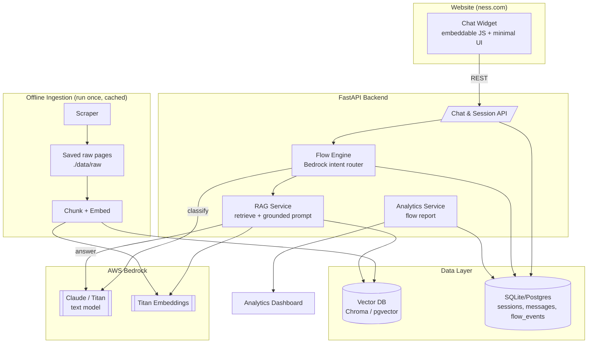

# Ness.com Bot — Solution Architecture

A RAG-based, flow-aware chatbot for ness.com, buildable in a one-day hackathon.
Stack: **AWS Bedrock + Python/FastAPI**, scrape-and-cache data, embedded chat widget.

## Architecture Diagram



## Components

- **Chat Widget** — Embeddable JS snippet injecting a chat bubble + panel; calls backend over REST with a per-browser `session_id`.
- **FastAPI Backend** — Chat & session API, flow engine, RAG service, analytics service.
- **Flow Engine** — Bedrock-based intent router classifying each turn into a flow (greeting, service list, service detail, general Q&A, fallback); logs `flow_events`.
- **RAG Service** — Retrieves top-k chunks from the vector DB, builds a grounded prompt, returns answers with source citations.
- **AWS Bedrock** — `claude-3-haiku`/`sonnet` for chat + classification; `titan-embed-text-v2` for embeddings.
- **Data Layer** — Chroma (or pgvector) for vectors; SQLite/Postgres for sessions, messages, and flow events.
- **Offline Ingestion** — Scrape a fixed seed list of ness.com pages, save raw to `./data/raw`, chunk + embed into the vector DB.

## Flows

1. `greeting` → static welcome
2. `service_list` → RAG over services + summary
3. `service_detail` → RAG scoped to a specific service (e.g., Salesforce)
4. `general_qa` → open RAG
5. `fallback` → clarify

## Persistence Schema

```
sessions(id, started_at, user_agent, meta)
messages(id, session_id, role, content, flow, sources, created_at)
flow_events(id, session_id, flow, intent_confidence, matched, created_at)
```

## API Contract

```
POST /chat
  req:  { session_id, message }
  res:  { reply, flow, sources: [{title, url}], suggestions? }

GET  /sessions/{id}         -> full transcript for review
GET  /analytics/report      -> flow analytics JSON
```

## Repo Layout

```
ness-bot/
├── data/raw/              # scraped, saved pages
├── ingest/scraper.py
├── ingest/ingest.py       # chunk + embed -> Chroma
├── app/main.py            # FastAPI
├── app/bedrock.py         # boto3 wrapper (chat + embed)
├── app/flows.py           # intent router + flow handlers
├── app/rag.py             # retrieve + prompt
├── app/db.py              # SQLite models
├── app/analytics.py
├── widget/widget.js       # embeddable chat
└── dashboard/report.html
```
