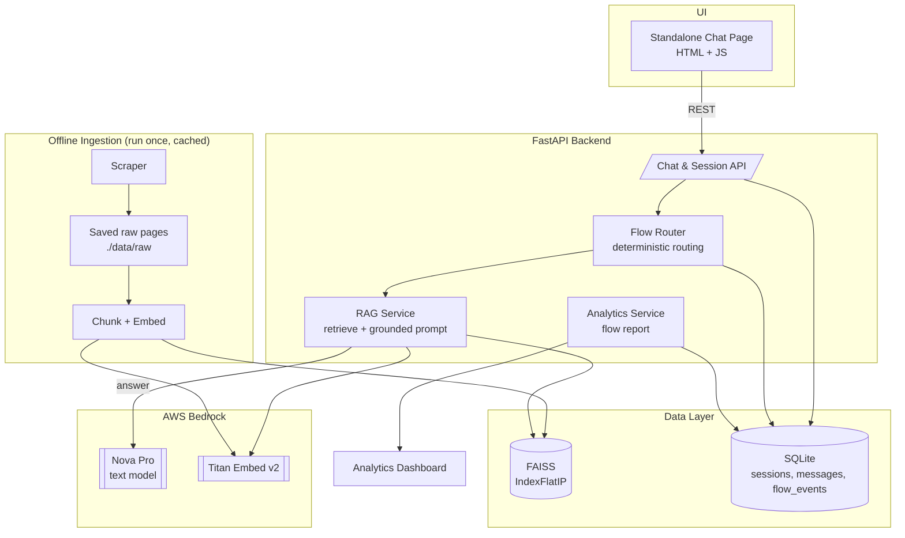
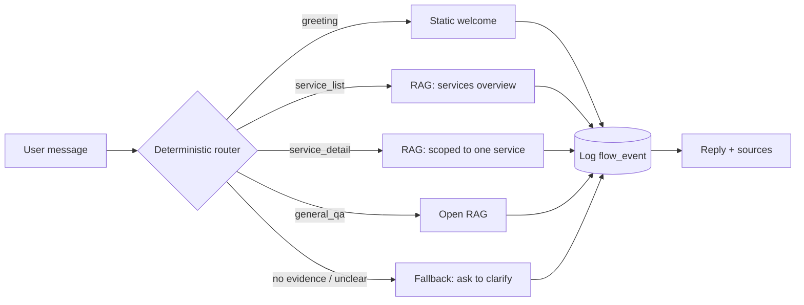
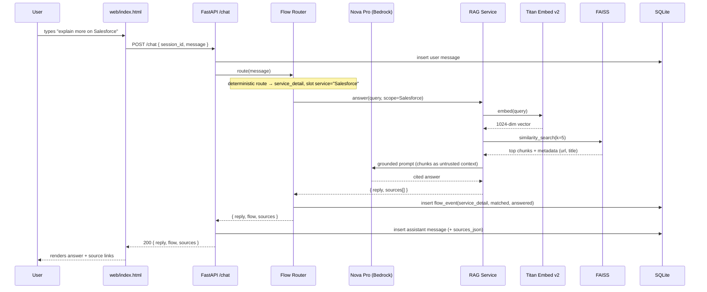
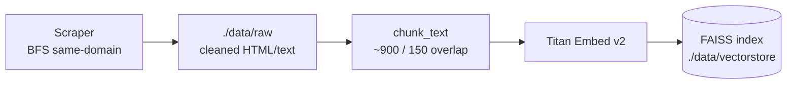

# Ness.com Bot — Solution Architecture

A RAG-based, flow-aware chatbot for ness.com, buildable in a one-day hackathon.
Stack: **AWS Bedrock + Python/FastAPI + standalone HTML/JS UI**, scrape-and-cache data.

## Architecture Diagram



## Components

- **Standalone Chat Page** — Chat page (message history + input) built with plain HTML/JS; calls the backend over REST with a `session_id` held in the browser.
- **FastAPI Backend** — Chat & session API, flow router, RAG service, analytics service.
- **Flow Router** — Deterministic router classifying each turn into a flow (greeting, service list, service detail, general Q&A, fallback) via simple rules; logs `flow_events`. No per-turn LLM classification.
- **RAG Service** — Retrieves top-k chunks from the vector DB, builds a grounded prompt, returns answers with source citations.
- **AWS Bedrock** — `amazon.nova-pro-v1:0` (Nova Pro) for chat; `amazon.titan-embed-text-v2:0` for embeddings.
- **Data Layer** — FAISS `IndexFlatIP` for vectors; SQLite for sessions, messages, and flow events.
- **Offline Ingestion** — Scrape a fixed seed list of ness.com pages, save raw to `./data/raw`, chunk + embed into the vector DB.

## Flow Router — what it does

The Flow Router is the "brain" that sits between the raw user message and the RAG/LLM
answer. Without it, every message would just be a generic RAG lookup. It gives the bot
**structure, control, and measurability**. For each incoming turn it does 4 things:

1. **Classify intent** — Applies deterministic rules (greeting check, service-list phrase,
   known service name, else general Q&A) to map the message to one of the known flows
   below. No LLM classification call on every turn.
2. **Route to a handler** — Each flow has its own logic and prompt, so answers are
   consistent and on-brand instead of a one-size-fits-all reply.
3. **Extract slots / context** — e.g., for `service_detail` it pulls out *which* service
   (`Salesforce`) and scopes the RAG retrieval filter to that service's pages only.
4. **Log a flow event** — Writes `flow_events` (flow, matched, whether it was answered)
   which directly powers the flow-analysis report.



### Flows it manages

| Flow | Trigger example | Handler behavior |
|---|---|---|
| `greeting` | "hi", "hello" | Static welcome message, no LLM/RAG needed |
| `service_list` | "what services do you provide" | RAG over service pages → summarized list |
| `service_detail` | "explain more on Salesforce" | Extract service slot → RAG filtered to that service |
| `general_qa` | "where are your offices" | Open RAG across all indexed pages |
| `fallback` | ambiguous / no evidence | Ask a clarifying question |

**Why it matters for the demo:** it satisfies the "manage flows as per website structure"
requirement, keeps answers grounded and scoped, and produces the events needed for the
"flow analysis report" — all from one component.

## Sample Flow — one chat turn

End-to-end trace of a single chat turn (`"explain more on Salesforce"`) from the
standalone page to the grounded answer.



### Step-by-step narration

1. **Client** — User types into the standalone chat page; JS holds `session_id` and POSTs to `/chat`.
2. **Persist inbound** — `/chat` writes the user message to SQLite immediately.
3. **Classify** — Flow Router applies deterministic rules to pick `{ flow, slots }`.
4. **Route decision**:
   - `greeting` → static reply, **no** RAG/embed.
   - `service_detail` (this example) → RAG scoped to the extracted service slot.
   - no evidence / unclear → `fallback` clarifying question (no hallucination).
5. **Retrieve** — RAG embeds the query with Titan, runs FAISS `IndexFlatIP` top-k search, gets chunks + source metadata.
6. **Ground** — Retrieved chunks are injected as **untrusted context** into the prompt; Nova Pro writes a cited answer.
7. **Log** — A `flow_event` row records flow, confidence, matched, answered (feeds analytics).
8. **Persist outbound** — Assistant message + `sources_json` saved; response returned to the browser.
9. **Render** — Standalone page shows the reply plus clickable source URLs.

### Offline ingestion flow (runs once, cached)



On backend startup, FAISS auto-loads from disk — no re-ingest needed.

## Persistence Schema

```
sessions(id, started_at, user_agent, meta)
messages(id, session_id, role, content, flow, sources, created_at)
flow_events(id, session_id, flow, intent_confidence, matched, created_at)
```

## API Contract

```
POST /chat
  req:  { session_id, message }
  res:  { reply, flow, sources: [{title, url}], suggestions? }

GET  /sessions/{id}         -> full transcript for review
GET  /analytics/report      -> flow analytics JSON
```

## Repo Layout

```
ness-bot/
├── data/raw/              # scraped, saved pages
├── ingest/scraper.py
├── ingest/ingest.py       # chunk + embed -> FAISS
├── app/main.py            # FastAPI
├── app/bedrock.py         # boto3 wrapper (chat + embed)
├── app/flows.py           # deterministic router + flow handlers
├── app/rag.py             # retrieve + prompt
├── app/db.py              # SQLite models
├── app/analytics.py
└── web/index.html         # standalone chat UI
```
